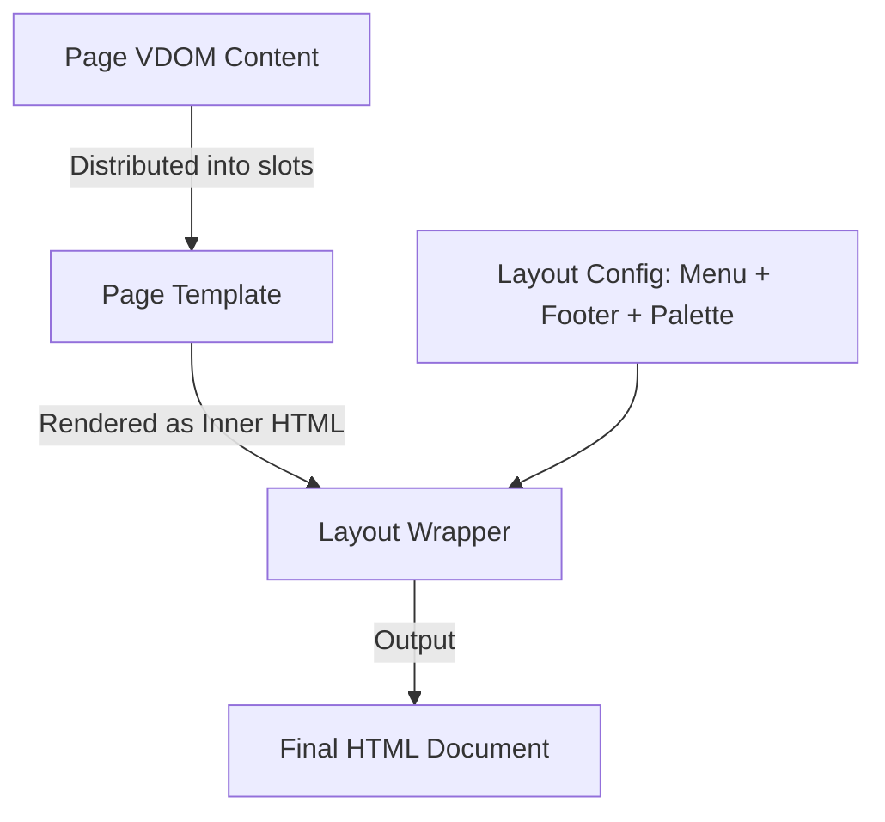
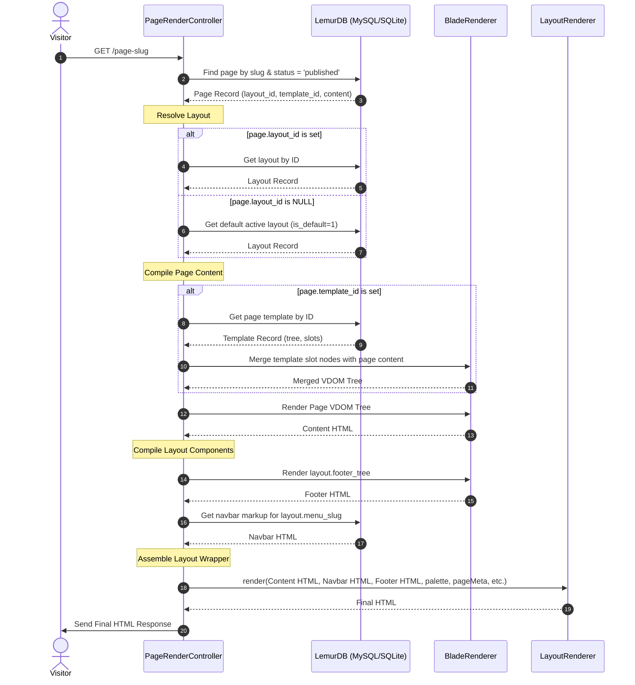

# Page-to-Layout Integration Guide

This document describes the architectural relationship between **Pages** and **Layouts** in Lemur CMS, detailing the rendering pipeline, database schema, and layout resolution sequence.

---

## 1. Architectural Concept

In Lemur CMS, page rendering is separated into three distinct layers:
1. **Content Structure (Page VDOM)**: The actual elements and blocks of the page (e.g., headers, paragraphs, cards).
2. **Page Template (Structure/Slots)**: A reusable wireframe (e.g., sidebar layout, full-width grid) where the Page VDOM nodes are distributed into specific `slot` nodes.
3. **Page Layout (Branding Wrapper)**: The global framing of the page, defining the navigation menu, footer VDOM tree, color palette, custom CSS/JS, and external asset injections (CDNs).



---

## 2. Database Schema

The relationship is established via a foreign key reference from the `pages` table to the `page_layouts` table.

```
┌─────────────────┐          ┌─────────────────┐
│     pages       │          │  page_layouts   │
├─────────────────┤          ├─────────────────┤
│ id (UUID)       │          │ id (UUID)       │
│ title           │          │ name            │
│ slug            │          │ description     │
│ content (JSON)  │─────────►│ menu_slug       │
│ status          │          │ footer_tree     │
│ layout_id       │          │ palette (JSON)  │
│ ...             │          │ is_default      │
└─────────────────┘          │ is_active       │
                             └─────────────────┘
```

### 2.1 The `page_layouts` Table
Defined in migration `20260522000008_create_page_layouts_table.php` and modified in `20260522000011_add_is_default_to_page_layouts.php`:

| Column | Type | Nullable | Description |
| :--- | :--- | :--- | :--- |
| `id` | `CHAR(36)` | No | Primary Key (UUID). |
| `name` | `VARCHAR(200)` | No | Internal name of the layout. |
| `description` | `TEXT` | Yes | Description or notes about the layout. |
| `menu_slug` | `VARCHAR(300)` | Yes | Slug of the navigation menu to display in the header. |
| `footer_tree` | `JSON` | Yes | VDOM node tree representing components in the footer. |
| `palette` | `JSON` | Yes | CSS variables mapping: `{'primary': '#3b5c...', 'text': ...}`. |
| `use_system_palette` | `TINYINT(1)` | No | If `1`, system default CSS colors are loaded. Default: `1`. |
| `is_active` | `TINYINT(1)` | No | Active state flag. Default: `1`. |
| `is_default` | `TINYINT(1)` | No | Marks layout as global fallback. Default: `0`. |
| `created_at` / `updated_at`| `DATETIME` | No | Timestamps. |

### 2.2 The `pages` Table Reference
Defined in migration `20260522000009_add_layout_id_to_pages.php`:

* Column `layout_id` (`CHAR(36)`, nullable) is appended to `pages`, referencing `page_layouts.id`.

---

## 3. The Page Resolution Pipeline

When a page is requested, `PageRenderController::show($slug)` processes the request using the following sequence:



---

## 4. Code Implementation Highlights

### 4.1 Layout Resolution in Controller
Located in [PageRenderController.php](file:///d:/repositories/lemur-books-lms-2/lemur-cms/src/Http/Controllers/PageRenderController.php):

```php
// Resolve layout
$layout = null;
if ($this->getLayoutById !== null && $this->getDefaultLayout !== null) {
    $layoutId = $page['layout_id'] ?? null;
    $layout   = ($layoutId ? $this->getLayoutById->execute($layoutId) : null)
             ?? $this->getDefaultLayout->execute();
}
```

### 4.2 HTML Wrapping in Layout Renderer
Located in [LayoutRenderer.php](file:///d:/repositories/lemur-books-lms-2/lemur-cms/src/PageBuilder/Domain/Service/LayoutRenderer.php):

```php
public function render(
    string $contentHtml,
    string $navbarHtml,
    string $footerHtml,
    array  $palette,
    array  $pageMeta,
    bool   $useSystemPalette = true,
    string $customCss = '',
    string $customJs  = '',
): string {
    // 1. Resolve basic metadata (title, meta description)
    // 2. Generate CSS Custom Properties block from layout palette variables
    // 3. Append custom CSS and JS blocks
    // 4. Wrap inner elements in standard HTML5 skeleton (html, head, body, header, main, footer)
}
```
