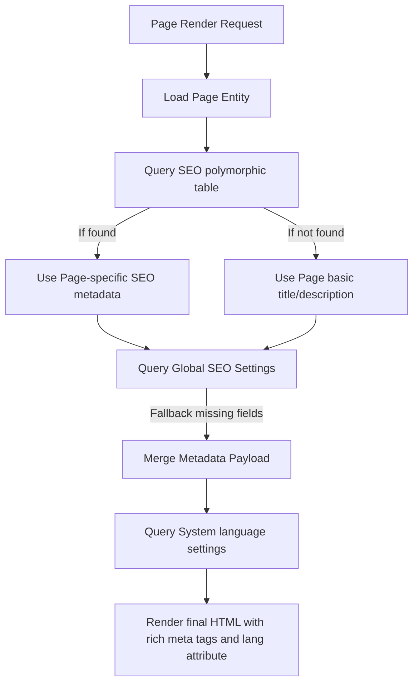

# SEO & Metadata System Documentation

This document describes the SEO metadata system in Lemur CMS, explaining its database structure, repository architecture, current rendering status, and the integration gaps that need to be resolved.

---

## 1. Database Schema

The SEO module is designed to store metadata polymorphically, allowing search engine options to attach to any database entity (e.g., Pages, Products, Categories, Blog Posts) without modifying their respective tables.

### 1.1 The `seo` Table
Defined in migration `20260510000003_create_seo_tables.php`:

| Column | Type | Nullable | Default | Description |
| :--- | :--- | :--- | :--- | :--- |
| `id` | `CHAR(36)` | No | - | Primary Key (UUID). |
| `entity_type` | `VARCHAR(100)`| No | - | Entity identifier (e.g. `'page'`). |
| `entity_id` | `CHAR(36)` | No | - | UUID of the entity. |
| `meta_title` | `VARCHAR(200)`| Yes | NULL | Override Title Tag for SEO. |
| `meta_description`| `VARCHAR(500)`| Yes | NULL | Meta description content. |
| `canonical_url` | `VARCHAR(500)`| Yes | NULL | Canonical URL tag content. |
| `og_title` | `VARCHAR(200)`| Yes | NULL | OpenGraph title. |
| `og_description` | `VARCHAR(500)`| Yes | NULL | OpenGraph description. |
| `og_image` | `VARCHAR(500)`| Yes | NULL | OpenGraph image file path/URL. |
| `robots` | `VARCHAR(100)`| Yes | `'index,follow'` | Robots directives (e.g., `noindex`). |
| `schema_json` | `JSON` | Yes | NULL | Custom JSON-LD schema markup. |
| `created_at` / `updated_at`| `DATETIME` | No | - | Timestamps. |

* **Index Constraint**: A unique index `uq_seo_entity` is set on `['entity_type', 'entity_id']` to ensure only one SEO metadata record exists per entity instance.

---

## 2. Code Architecture

### 2.1 Domain Layer Interface
Located in [SeoRepositoryInterface.php](../../../src/Seo/Domain/Repository/SeoRepositoryInterface.php):

```php
namespace LemurCms\Seo\Domain\Repository;

interface SeoRepositoryInterface
{
    public function findByEntity(string $entityType, int $entityId): ?array;
    public function upsert(string $entityType, int $entityId, array $data): void;
}
```
*(Note: Although entity IDs in migrations are UUID CHAR(36), the interface specifies type limits or formats depending on the database adapter. The concrete adapter supports string/UUID parameters).*

### 2.2 Infrastructure Implementation
Located in [LemurDbSeoRepository.php](../../../src/Seo/Infrastructure/LemurDbSeoRepository.php):
Implements the interface by querying the `seo` table using the custom `LemurDB` query builder.

---

## 3. Current Gaps and Integration Status

While the database structure and repositories for SEO exist and are tested, **the SEO metadata system is currently disconnected from the frontend page rendering pipeline.**

### Gap 1: PageRenderController Does Not Query SEO Table
During page load, [PageRenderController.php](../../../src/Http/Controllers/PageRenderController.php#L98-L102) resolves metadata properties by reading directly from the `pages` table fields:
```php
$pageMeta = [
    'title'       => $page['title'] ?? '',
    'description' => $page['meta_description'] ?? '',
    'slug'        => $page['slug'] ?? $slug,
];
```
* **Consequence**: Custom metadata (canonical URL, OpenGraph titles, OpenGraph images, index/follow robots directives, and schema JSON-LD scripts) defined in the `seo` table is completely ignored and never rendered in the `<head>` of the page.

### Gap 2: No Global SEO Defaults
If a page does not have custom SEO metadata, there is no system to load global fallbacks (e.g., global site name, default fallback description, default share image).

### Gap 3: Hardcoded Platform Language
The `LayoutRenderer` generates the HTML structure with a static, hardcoded language attribute:
```html
<html lang="es">
```
* **Consequence**: There is no way for dynamic websites to change the platform language tag (e.g., to English `en` or Portuguese `pt`) globally or on a per-page basis.

---

## 4. Proposed Integration Plan

To close these integration gaps, the rendering pipeline should be updated with the following architectural adjustments:



### Proposed Action Items:
1. **Inject `SeoRepositoryInterface`** into `PageRenderController`.
2. **Fetch SEO metadata** using `$this->seoRepository->findByEntity('page', $page['id'])` and pass it to the `$pageMeta` payload.
3. **Extend `LayoutRenderer::render()`** to output:
   - `<link rel="canonical" href="...">`
   - `<meta name="robots" content="...">`
   - OpenGraph Meta Tags (`og:title`, `og:description`, `og:image`)
   - `<script type="application/ld+json">...</script>` blocks for JSON-LD schemas.
4. **Make Language Configurable**: Fetch the platform language key (e.g., from settings repository: `$this->settingsRepository->get('site_language', 'es')`) and pass it to `LayoutRenderer` to replace `<html lang="es">` with `<html lang="{$lang}">`.
